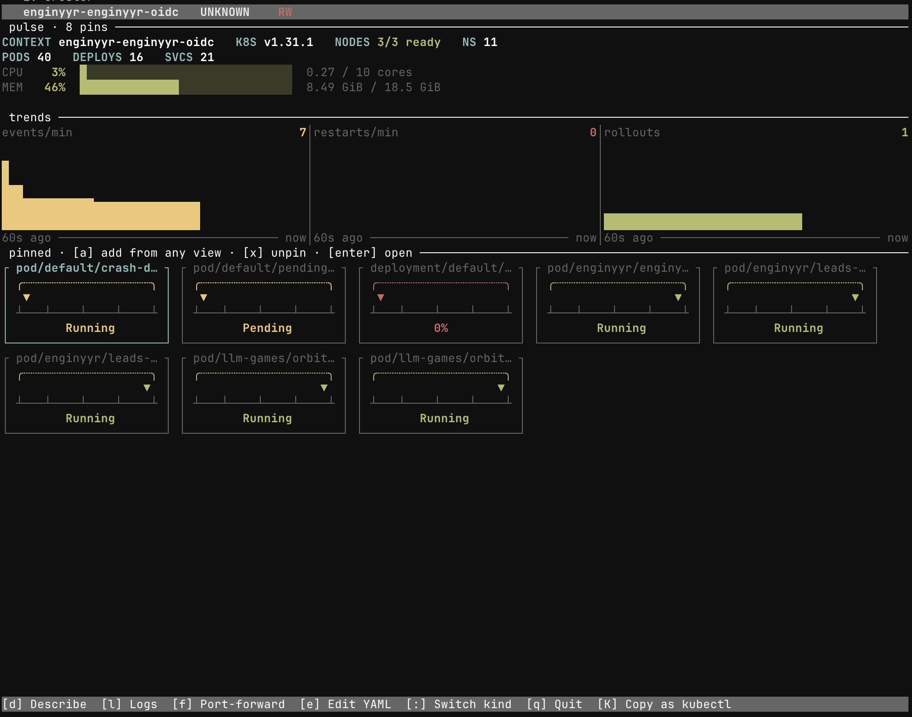

# cruster

A Kubernetes TUI for people who live in k9s all day. Built in Rust.
Optimized for speed, ergonomics, and Claude Code compatibility.



This repository is a monorepo:

- `app/` — the Rust TUI + CLI (cargo workspace, `cd app && cargo build`)
- `skills/` — agentskills.io-format skills for any compatible AI agent
- `plugins/claude-code/` — Claude Code plugin (skills + slash commands)
- `Formula/` — homebrew formula
- `web/` — landing page (plain HTML + CSS, deployable anywhere)
- `docs/` — specs, implementation plans, `RELEASING.md` runbook
- `.github/workflows/` — CI + release pipelines

## Status

**Phase 6A.** Pulse dashboard is now the default launch view —
cluster stats + trend sparklines + a curated panel of user-pinned
services. Press `a` from any list view to pin the selected
resource; pins persist in `~/.config/cruster/dashboard.toml`.
Press `:dashboard` (or `:pulse`) to jump back from any other
view. Closes #1.

**Phase 5C complete — v1 MVP scope closed.** Landing page lives at
`web/index.html` (plain HTML + CSS, no build step). Preview locally
with `cd web && python3 -m http.server`. Deploy by dropping `web/`
on any static host.

**Phase 5B.** Distribution: `cargo install`, homebrew formula, and
CI release workflow (macOS arm64/Intel + Linux x86_64). See
[`docs/RELEASING.md`](docs/RELEASING.md) for the cut-a-release
runbook.

**Phase 5A.** License loader + 14-day trial:

```sh
cruster license show       # current tier; reports "free" if no file
cruster license verify     # exit 0 if license valid, non-zero with reason
cruster license path       # canonical license file path
cruster trial              # writes a 14-day Pro trial license
```

The TUI's existing Pro gates (`P` prompts, `E` export, theme
switching) now honour the loaded tier. Licenses use ed25519
signatures against an embedded public key; trial files skip the
signature but enforce the 14-day cap.

**Phase 4B**: agent distribution surface (skills + Claude Code plugin
+ install.sh).

- **`skills/`** — three agentskills.io-format skills
  (`cruster-investigate-pod`, `cruster-resource-bundle`,
  `cruster-recent-activity`) that drop into Claude Code, Cursor,
  Codex, Gemini CLI, Goose, OpenHands, and other agentskills.io-
  compatible agents.
- **`plugins/claude-code/`** — a Claude Code plugin bundling the
  same three skills plus three slash commands: `/cruster:investigate`,
  `/cruster:bundle`, `/cruster:recent`.
- **`install.sh`** — one-shot installer
  (`./install.sh --agent claude`) for any of the supported targets.

Phase 4A: prompt actions (`P` leader) and diagnostic export (`E` in
TUI, `cruster export` in CLI). Phase 4A quick wins: inline schemas
in `help-json` and a filter-empty sentinel in `events --resource`.

Earlier: Phase 1 skeleton, Phase 2A TUI parity, Phase 2B LLM-efficient
CLI, Phase 3A ergonomics, Phase 3B task-first navigation, Phase 3C
themes (Pro-gated), Phase 3D keymap presets + named layouts, Phase 3E
visual polish (thin top rule, `▎` selection accent, pane focus + Tab,
modal port-forward).

**v1 MVP complete.** Remaining work is real-world: benchmark
measurement, first GitHub release, homebrew tap, paid signup flow,
multi-cluster, GitOps visibility.

## Install

### Cargo (any platform with a Rust toolchain)

```sh
cargo install --git https://github.com/thedouglenz/cruster.git \
  --bin cruster --locked
```

### Homebrew (macOS / Linux, once the tap is published)

```sh
brew tap thedouglenz/cruster
brew install cruster
```

### Prebuilt binary

Grab the tarball for your platform from the
[releases page](https://github.com/thedouglenz/cruster/releases),
extract, and put `cruster` somewhere on `$PATH`.

### From source

```sh
cd app && cargo build --release && cp target/release/cruster ~/.local/bin/
```

## Quick start

TUI:
```sh
cd app && cargo run --release -p cruster-bin
```

CLI:
```sh
cd app
cargo build --release -p cruster-bin
./target/release/cruster get pods
./target/release/cruster get pods --format ndjson | jq .
./target/release/cruster describe pod/nginx -n default --format yaml
./target/release/cruster logs nginx -n default --tail 50 --grep error
./target/release/cruster events --limit 5
./target/release/cruster schema get-pod | jq .title
./target/release/cruster help-json | jq '.[].name'
./target/release/cruster export pod/nginx -n default -o report.md
```

See `app/README.md` for the full TUI keymap.

## Agent integration

Cruster's CLI is designed to be driven by an AI coding agent. Two
levels of integration:

### Level 1 — drop-in agentskills

For any agent that reads agentskills.io-format skill directories
(Claude Code, Cursor, Codex, Goose, OpenHands, Gemini CLI, ...):

```sh
./install.sh --agent claude      # → ~/.claude/skills/
./install.sh --agent cursor      # → ./.cursor/skills/
./install.sh --agent generic     # → ~/.agentskills/
```

`./install.sh --help` for the full flag list (`--dry-run`, `--force`).

### Level 2 — Claude Code plugin

Adds slash commands on top of the skills:

```sh
ln -s "$PWD/plugins/claude-code" ~/.claude/plugins/cruster
```

Slash commands:

- `/cruster:investigate <kind>/<name> [-n <ns>]` — diagnose & summarise
- `/cruster:bundle <kind>/<name> [-n <ns>]` — write a markdown report
- `/cruster:recent [-n <ns>]` — namespace triage

See `plugins/claude-code/README.md` for details.

## License

Cruster is proprietary software. See [`LICENSE`](LICENSE) for the
full terms. In short: download and run unmodified for evaluation or
end use, but redistribution, modification, hosting as a service, or
any other use beyond running the binary requires written permission
from the copyright holder. Contributions are accepted on an
inbound = outbound basis under the same proprietary terms — see
section 4 of `LICENSE`.

## Project layout

```
cruster/
├── app/
│   ├── crates/
│   │   ├── cruster-core/   # shared types (ResourceKey, Environment, Snapshot)
│   │   ├── cruster-kube/   # kube-rs wrapper, watch streams, ResourceKind, StoreRegistry
│   │   ├── cruster-tui/    # ratatui app, ResourceView trait, views, actions, overlays, prompts, export, safety
│   │   ├── cruster-cli/    # clap CLI, Formatter, prune, budget, per-verb modules + schemas
│   │   └── cruster-bin/    # single `cruster` binary; dispatches TUI vs CLI
│   └── benches/
├── skills/                  # agentskills.io-format skills (drop into any compatible agent)
├── plugins/
│   └── claude-code/         # Claude Code plugin: skills + slash commands
├── install.sh               # one-shot skills installer (--agent claude|cursor|generic)
├── web/                     # marketing site (Phase 5)
└── docs/                    # specs and implementation plans
```
